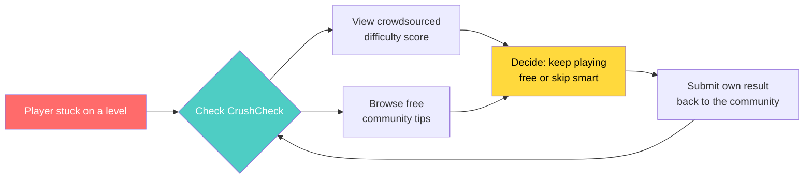
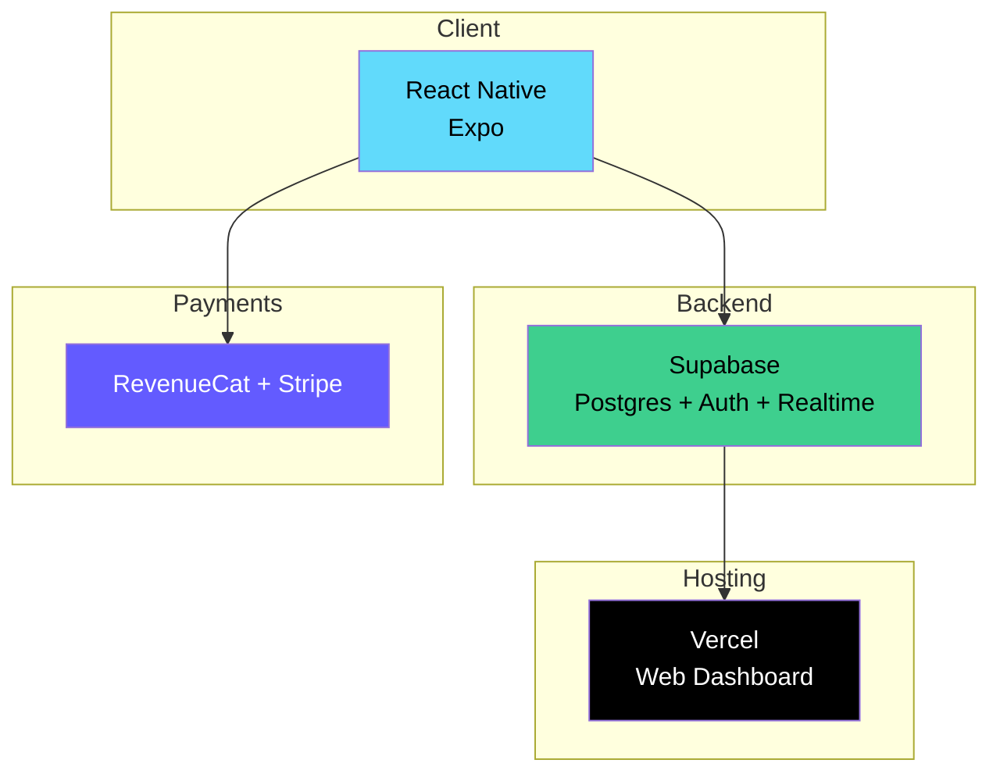
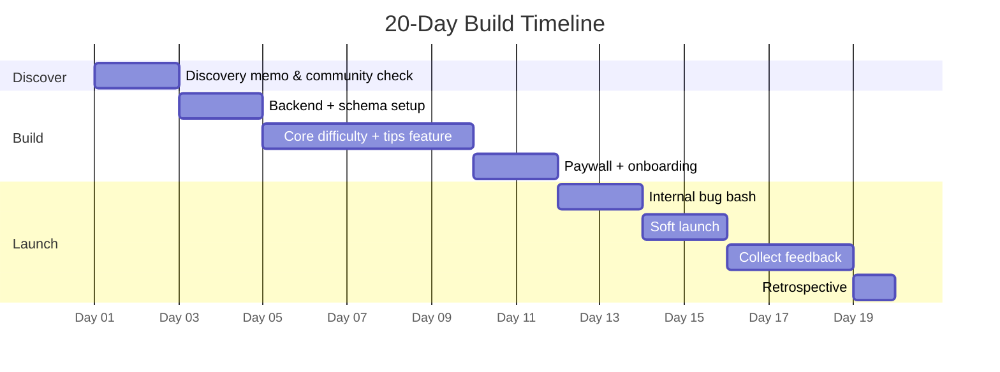

<div align="center">


### 🍬 A crowdsourced difficulty & tips companion for Candy Crush Saga players


</div>

---

## 📌 What is this?

**CrushCheck** solves a real, validated problem: Candy Crush Saga players routinely get stuck on levels for days, feeling pushed to spend real money on boosters just to progress. CrushCheck crowdsources real difficulty data from players — showing which levels have a high "forced-purchase rate" *before* you hit them — paired with free, community-submitted strategy tips.

> 📄 Full research, validation, and product plan: [`assignment2.md`](./assignment2.md)

---

## 🎯 The Problem (in one glance)

<div align="center">

| Signal | Finding |
|---|---|
| 🗣️ Negative review mining | Players describe higher levels as "impossible" without spending gold bars |
| 💬 Community dwelling | Decade-old forum threads show the same "stuck for a week, forced to pay" pattern, still active today |
| 📊 Classification | **Painkiller**, not a vitamin — real, recurring financial frustration |

</div>

---

## 🏗️ How it works



---

## ⚙️ Tech Stack



| Layer | Choice | Why |
|---|---|---|
| Frontend | React Native (Expo) | One codebase, two stores, fast solo build |
| Backend | Supabase | Free at 0–1k users, built-in auth + realtime |
| Payments | RevenueCat + Stripe | No custom billing — solved problem, not the moat |
| Hosting | Vercel | Zero-ops deploys for the companion dashboard |

---

## 🗺️ Roadmap



- [x] Problem validated with real review + community data
- [x] Product plan documented ([assignment2.md](./assignment2.md))
- [ ] MVP built (difficulty lookup + tips)
- [ ] Subscription paywall live
- [ ] Soft launch to first community
- [ ] User feedback collected
- [ ] Closing retrospective

---

## 💰 Monetization

<div align="center">

| Tier | Price | What you get |
|---|---|---|
| 🆓 Free | $0 | Unlimited difficulty lookups, view top-voted tips |
| ⭐ Premium | $2.99/mo | Unlimited tip submissions, ad-free, early access to new levels |

</div>

---

## 📂 Repo Structure

```
ai-seekho/
├── assignment1.md
├── assignment2.md      ← full product plan (this project)
└── README.md            ← you are here
```

---

## 🙋 Reflection

> The most surprising finding during validation: this exact complaint pattern — "stuck for a week, forced to pay" — shows up in forum posts from over a decade ago *and* in reviews posted this year, almost word for word. That durability is what convinced me this is a real, lasting painkiller and not a passing complaint.

---

<div align="center">

Made with 🍬 and a healthy amount of frustration at energy bars, for **AI SEEKHO**.

</div>
